DropTable Box Bomb (DropTable)
- Probability: 1
  - Consumable: Consumable Bomb (WeaponBasedConsumable)

DropTable Unit BouncerRed (DropTable)
- Count: 10-15
  - Prefab: ResourcePickup_Money (UnityEngine.GameObject)

DropTable Unit CrossJock (DropTable)
- Count: 100
  - Prefab: ResourcePickup_Money (UnityEngine.GameObject)
- Count: 15
  - Prefab: ResourcePickup_Money_50 (UnityEngine.GameObject)
- Probability: 1
  - Module: Module BoosterCore (ModuleData)
  - Weight: 10
  - Module: Module Aug Caps AddExplosion (ModuleData)
  - Weight: 5
  - Module: Module Passive Regen Stamina (ModuleData)
  - Weight: 10
  - Module: Module Aug White AddExplosion (ModuleData)
  - Weight: 10
  - Module: Module Aug Add Burn (ModuleData)
  - Weight: 5
  - Module: Module Aug Electron AddSpark (ModuleData)
  - Weight: 20
  - Module: Module Aug Purple AddExplosion (ModuleData)
  - Weight: 5
  - Ingredient: Ingredient Powerstar (Ingredient)
  - Weight: 20
  - Module: Module Weapon White Popper (WeaponModuleData)
  - Weight: 10
  - Module: Module Weapon White Bolt (WeaponModuleData)
  - Weight: 10
  - Module: Module Weapon White DiscGun (WeaponModuleData)
  - Weight: 10
  - Module: Module Weapon White Derbis (WeaponModuleData)
  - Weight: 10
  - Module: Module Weapon White Dart (WeaponModuleData)
  - Weight: 10
  - Module: Module Weapon White Shotgun (WeaponModuleData)
  - Weight: 10
  - Module: Module Weapon White Worm (WeaponModuleData)
  - Weight: 10
  - Module: Module Weapon White Blades (WeaponModuleData)
  - Weight: 10
  - Module: Module Passive Add Stamina (ModuleData)
  - Weight: 1
  - Module: Module Active Purple Teardrop (WeaponBasedActiveModuleData)
  - Weight: 30
- Count: 1
  - Ingredient: Ingredient Powerstar (Ingredient)
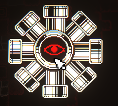

DropTable Unit Cross (DropTable)
- Count: 3-4
  - Prefab: ResourcePickup_Money (UnityEngine.GameObject)
- Probability: 0.1
  - Prefab: ResourcePickup_Money_20 (UnityEngine.GameObject)
- Probability: 1
  - Prefab: Corpse (UnityEngine.GameObject)
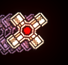

DropTable Unit FlyAlfa (DropTable)
- Count: 10
  - Prefab: ResourcePickup_Money_20 (UnityEngine.GameObject)
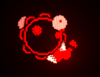

DropTable Unit FlyZapper (DropTable)
- Count: 20-25
  - Prefab: ResourcePickup_Money_20 (UnityEngine.GameObject)
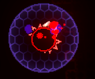

DropTable Sage (DropTable)
- Count: 2-3
  - Prefab: ResourcePickup Caps (UnityEngine.GameObject)

DropTable Cactus (DropTable)
- Count: 10-15
  - Prefab: ResourcePickup Caps (UnityEngine.GameObject)
- Count: 1
  - Ingredient: Ingredient Gland (Ingredient)

DropTable Unit Larva (DropTable)
- Count: 0
  - Prefab: ResourcePickup_Money (UnityEngine.GameObject)
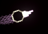

DropTable Unit CrossRed Bomber (DropTable)
- Count: 100
  - Prefab: ResourcePickup_Money (UnityEngine.GameObject)
- Count: 150
  - Prefab: ResourcePickup_Money_50 (UnityEngine.GameObject)
- Count: 5
  - Ingredient: Ingredient Powerstar (Ingredient)
- Count: 1
  - Module: Module BoosterCore (ModuleData)
  - Weight: 10
  - Module: Module Aug Caps AddExplosion (ModuleData)
  - Weight: 5
  - Module: Module Passive Regen Stamina (ModuleData)
  - Weight: 10
  - Module: Module Aug White AddExplosion (ModuleData)
  - Weight: 10
  - Module: Module Aug Add Burn (ModuleData)
  - Weight: 5
  - Module: Module Aug Electron AddSpark (ModuleData)
  - Weight: 20
  - Module: Module Aug Purple AddExplosion (ModuleData)
  - Weight: 5
  - Ingredient: Ingredient Powerstar (Ingredient)
  - Weight: 20
  - Module: Module Weapon White Popper (WeaponModuleData)
  - Weight: 10
  - Module: Module Weapon White Bolt (WeaponModuleData)
  - Weight: 10
  - Module: Module Weapon White DiscGun (WeaponModuleData)
  - Weight: 10
  - Module: Module Weapon White Derbis (WeaponModuleData)
  - Weight: 10
  - Module: Module Weapon White Dart (WeaponModuleData)
  - Weight: 10
  - Module: Module Weapon White Shotgun (WeaponModuleData)
  - Weight: 10
  - Module: Module Weapon White Worm (WeaponModuleData)
  - Weight: 10
  - Module: Module Weapon White Blades (WeaponModuleData)
  - Weight: 10
  - Module: Module Passive Add Stamina (ModuleData)
  - Weight: 1
  - Module: Module Active Purple Teardrop (WeaponBasedActiveModuleData)
  - Weight: 30
- Count: 25
  - Prefab: FuelPickup (UnityEngine.GameObject)
- Count: 10
  - Prefab: ResourcePickup_Red (UnityEngine.GameObject)

DropTable Unit CrossPin (DropTable)
- Probability: 1
  - Prefab: Corpse CrossPin (UnityEngine.GameObject)
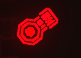

DropTable Unit Rookie (DropTable)
- Count: 7
  - Prefab: ResourcePickup_Money (UnityEngine.GameObject)
- Count: 7
  - Prefab: ResourcePickup_Money_20 (UnityEngine.GameObject)

DropTable Unit CrossRed Electron (DropTable)
- Count: 100
  - Prefab: ResourcePickup_Money (UnityEngine.GameObject)
- Count: 150
  - Prefab: ResourcePickup_Money_50 (UnityEngine.GameObject)
- Count: 5
  - Ingredient: Ingredient Powerstar (Ingredient)
- Count: 1
  - Ingredient: Ingredient Chip (Ingredient)
- Count: 25
  - Prefab: FuelPickup (UnityEngine.GameObject)

DropTable Unit Zipper (DropTable)
- Count: 4-5
  - Prefab: ResourcePickup_Money (UnityEngine.GameObject)
- Count: 3
  - Prefab: ResourcePickup_Money_20 (UnityEngine.GameObject)

NippleDropTable (DropTable)
- Count: 1-2
  - Prefab: ResourcePickup_Purple (UnityEngine.GameObject)

DropTable BlueFruit (DropTable)
- Count: 30
  - Prefab: FuelPickup (UnityEngine.GameObject)
- Probability: 1
  - Prefab: Fruit Blue Generator (UnityEngine.GameObject)

DropTable Unit Soldier (DropTable)
- Count: 10
  - Prefab: ResourcePickup_Money (UnityEngine.GameObject)
- Count: 10
  - Prefab: ResourcePickup_Money_20 (UnityEngine.GameObject)
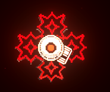

DropTable Unit Turret (DropTable)
- Count: 30
  - Prefab: ResourcePickup_Money (UnityEngine.GameObject)
- Count: 10-20
  - Prefab: ResourcePickup_Money_20 (UnityEngine.GameObject)
- Count: 5
  - Prefab: ResourcePickup_Red (UnityEngine.GameObject)
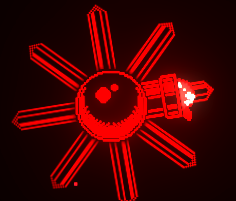

DropTable Box Money (DropTable)
- Count: 8
  - Prefab: ResourcePickup_Money_50 (UnityEngine.GameObject)

DropTable Unit Queen (DropTable)
- Count: 100
  - Prefab: ResourcePickup_Money (UnityEngine.GameObject)
- Count: 100
  - Prefab: ResourcePickup_Money_50 (UnityEngine.GameObject)
- Count: 3
  - Module: Module BoosterCore (ModuleData)
  - Weight: 30
  - Module: Module Aug Caps AddExplosion (ModuleData)
  - Weight: 5
  - Module: Module Passive Regen Stamina (ModuleData)
  - Weight: 20
  - Module: Module Aug White AddExplosion (ModuleData)
  - Weight: 5
  - Module: Module Aug Add Burn (ModuleData)
  - Weight: 5
  - Module: Module Aug Electron AddSpark (ModuleData)
  - Weight: 20
  - Module: Module Aug Purple AddExplosion (ModuleData)
  - Weight: 5
  - Ingredient: Ingredient Powerstar (Ingredient)
  - Weight: 20
  - Module: Module Weapon White Popper (WeaponModuleData)
  - Weight: 10
  - Module: Module Weapon White Bolt (WeaponModuleData)
  - Weight: 10
  - Module: Module Weapon White DiscGun (WeaponModuleData)
  - Weight: 10
  - Module: Module Weapon White Derbis (WeaponModuleData)
  - Weight: 10
  - Module: Module Weapon White Dart (WeaponModuleData)
  - Weight: 10
  - Module: Module Weapon White Shotgun (WeaponModuleData)
  - Weight: 10
  - Module: Module Weapon White Worm (WeaponModuleData)
  - Weight: 10
  - Module: Module Weapon White Blades (WeaponModuleData)
  - Weight: 10
  - Module: Module Passive Add Stamina (ModuleData)
  - Weight: 1
  - Module: Module Active Purple Teardrop (WeaponBasedActiveModuleData)
  - Weight: 30
- Probability: 1
  - Module: Module PowerCore (ModuleData)
- Count: 25
  - Prefab: FuelPickup (UnityEngine.GameObject)
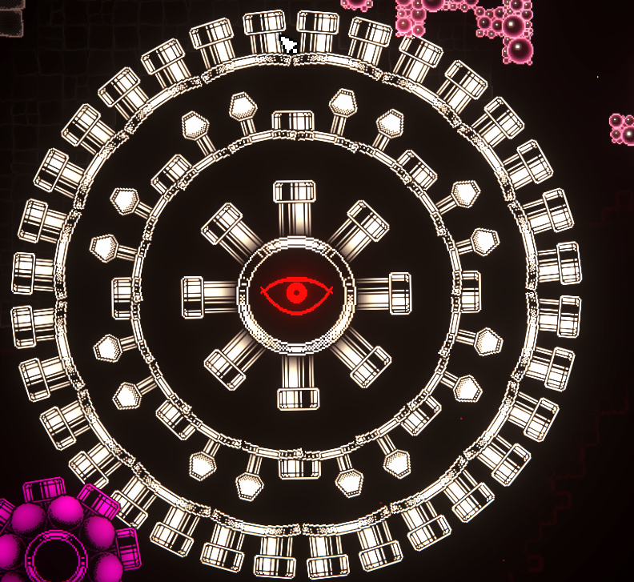

DropTable Unit FlyLaser (DropTable)
- Count: 10
  - Prefab: ResourcePickup_Money (UnityEngine.GameObject)
- Count: 10
  - Prefab: ResourcePickup_Money_20 (UnityEngine.GameObject)
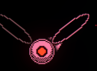

NippleLargeDropTable (DropTable)
- Count: 2-3
  - Prefab: ResourcePickup_Purple (UnityEngine.GameObject)

DropTable Tube (DropTable)
- Probability: 1
  - Prefab: ResourcePickup Tech (UnityEngine.GameObject)

DropTable VeinFruit (DropTable)
- Count: 2-3
  - Prefab: ResourcePickup_Red (UnityEngine.GameObject)

DropTable Unit Fish (DropTable)
- Count: 20-25
  - Prefab: ResourcePickup_Money (UnityEngine.GameObject)
- Count: 1
  - Prefab: ResourcePickup_Money_50 (UnityEngine.GameObject)

DropTable Crate Level2 (DropTable)
- Probability: 1
  - Ingredient: Ingredient Shell (Ingredient)
- Count: 100
  - Prefab: ResourcePickup_Money (UnityEngine.GameObject)
- Count: 15
  - Prefab: ResourcePickup_Red (UnityEngine.GameObject)
- Count: 5
  - Prefab: ResourcePickup_Red (UnityEngine.GameObject)
- Count: 15
  - Prefab: FuelPickup (UnityEngine.GameObject)

DropTable Unit CrossJockCaps (DropTable)
- Count: 100
  - Prefab: ResourcePickup_Money (UnityEngine.GameObject)
- Count: 15
  - Prefab: ResourcePickup_Money_50 (UnityEngine.GameObject)
- Count: 1
  - Ingredient: Ingredient Gland (Ingredient)
- Count: 1
  - Ingredient: Ingredient Powerstar (Ingredient)
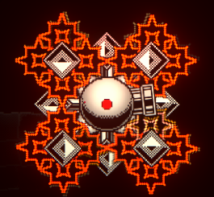

DropTable Unit CrossSmall Red (DropTable)
- Count: 150
  - Prefab: ResourcePickup_Money (UnityEngine.GameObject)
- Count: 60
  - Prefab: ResourcePickup_Money_50 (UnityEngine.GameObject)
- Count: 3
  - Ingredient: Ingredient Powerstar (Ingredient)
- Count: 0
  - Prefab: 
- Count: 25
  - Prefab: FuelPickup (UnityEngine.GameObject)
- Count: 10
  - Prefab: ResourcePickup_Red (UnityEngine.GameObject)

DropTable Crate Purple (DropTable)
- Probability: 1
  - Module: Module Aug Purple AddExplosion (ModuleData)
  - Weight: 30
  - Module: Module Active Purple Teardrop (WeaponBasedActiveModuleData)
  - Weight: 30
  - Module: Module Active Purple AirMines (WeaponBasedActiveModuleData)
  - Weight: 15
  - Module: Module Active Drone Purple (SpawnMinionModuleData)
  - Weight: 10
  - Module: Module Weapon Purple Shard (WeaponModuleData)
  - Weight: 15
  - Module: Module Weapon Purple Rocket (WeaponModuleData)
  - Weight: 15
  - Module: Module Weapon Purple Marbles (WeaponModuleData)
  - Weight: 15
  - Module: Module Weapon Purple ClusterCube (WeaponModuleData)
  - Weight: 10
  - Module: Module Passive Shield Purple (ModuleData)
  - Weight: 10
  - Module: Module Active Purple Surge (WeaponBasedActiveModuleData)
  - Weight: 10
  - Module: Module Passive Add Purple (ModuleData)
  - Weight: 1
- Count: 15
  - Prefab: FuelPickup (UnityEngine.GameObject)
- Count: 15
  - Prefab: ResourcePickup_Purple (UnityEngine.GameObject)
- Count: 5
  - Prefab: ResourcePickup_Red (UnityEngine.GameObject)
- Count: 1-2
  - Ingredient: Ingredient Coral (Ingredient)

DropTable Crate Green (DropTable)
- Probability: 1
  - Module: Module BoosterCore (ModuleData)
- Count: 15
  - Prefab: FuelPickup (UnityEngine.GameObject)
- Count: 5
  - Prefab: ResourcePickup_Red (UnityEngine.GameObject)

DropTable Unit CrossRed (DropTable)
- Count: 100
  - Prefab: ResourcePickup_Money (UnityEngine.GameObject)
- Count: 150
  - Prefab: ResourcePickup_Money_50 (UnityEngine.GameObject)
- Count: 5
  - Ingredient: Ingredient Powerstar (Ingredient)
- Count: 25
  - Prefab: FuelPickup (UnityEngine.GameObject)

DropTable Crate Money (DropTable)
- Count: 50
  - Prefab: ResourcePickup_Money (UnityEngine.GameObject)
- Count: 30
  - Prefab: ResourcePickup_Money_50 (UnityEngine.GameObject)
- Count: 15
  - Prefab: FuelPickup (UnityEngine.GameObject)
- Count: 5
  - Prefab: ResourcePickup_Red (UnityEngine.GameObject)

DropTable Unit FlyDad (DropTable)
- Count: 4-5
  - Prefab: ResourcePickup_Money (UnityEngine.GameObject)
- Count: 1
  - Prefab: ResourcePickup_Money_20 (UnityEngine.GameObject)

DropTable Unit CrossSmallTech (DropTable)
- Count: 150
  - Prefab: ResourcePickup_Money (UnityEngine.GameObject)
- Count: 60
  - Prefab: ResourcePickup_Money_50 (UnityEngine.GameObject)
- Count: 1
  - Ingredient: Ingredient Chip (Ingredient)
- Count: 3
  - Ingredient: Ingredient Powerstar (Ingredient)
- Count: 25
  - Prefab: FuelPickup (UnityEngine.GameObject)
- Count: 5
  - Prefab: ResourcePickup Tech (UnityEngine.GameObject)

DropTable Unit Maggot (DropTable)
- Count: 1-3
  - Prefab: ResourcePickup_Money_20 (UnityEngine.GameObject)
- Count: 10
  - Prefab: ResourcePickup_Money (UnityEngine.GameObject)
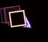

DropTable Box FuelGen (DropTable)
- Probability: 1
  - Consumable: Consumable FuelGenerator (SpawnPrefabConsumable)

DropTable Unit CrossTablet (DropTable)
- Count: 4-5
  - Prefab: ResourcePickup_Money (UnityEngine.GameObject)
- Probability: 1
  - Prefab: Corpse CrossTablet (UnityEngine.GameObject)
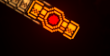

MaracujaDropTable (DropTable)
- Count: 3-6
  - Prefab: ResourcePickup Caps (UnityEngine.GameObject)

DropTable Box Matchbox (DropTable)
- Probability: 1
  - Consumable: Consumable Matchbox (WeaponBasedConsumable)

DropTable Box Beacon (DropTable)
- Probability: 1
  - Consumable: Consumable Beacon (SpawnMinionConsumable)

DropTable Unit CrossSmallCaps (DropTable)
- Count: 150
  - Prefab: ResourcePickup_Money (UnityEngine.GameObject)
- Count: 60
  - Prefab: ResourcePickup_Money_50 (UnityEngine.GameObject)
- Count: 3
  - Ingredient: Ingredient Powerstar (Ingredient)
- Count: 5
  - Ingredient: Ingredient Gland (Ingredient)
- Count: 25
  - Prefab: FuelPickup (UnityEngine.GameObject)

DropTable Unit Grunt (DropTable)
- Count: 1-3
  - Prefab: ResourcePickup_Money (UnityEngine.GameObject)

DropTable Unit Fly (DropTable)
- Count: 2-3
  - Prefab: ResourcePickup_Money (UnityEngine.GameObject)
- Probability: 0.1
  - Prefab: ResourcePickup_Money_20 (UnityEngine.GameObject)
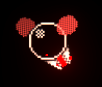

WheatDropTable (DropTable)
- Count: 2-3
  - Prefab: ResourcePickup_Money (UnityEngine.GameObject)
- Probability: 0.1
  - Prefab: ResourcePickup_Money_20 (UnityEngine.GameObject)

DropTable Unit CrossJockPurple (DropTable)
- Count: 100
  - Prefab: ResourcePickup_Money (UnityEngine.GameObject)
- Count: 15
  - Prefab: ResourcePickup_Money_50 (UnityEngine.GameObject)
- Count: 3
  - Ingredient: Ingredient Coral (Ingredient)
- Count: 1
  - Ingredient: Ingredient Powerstar (Ingredient)
- Count: 10
  - Prefab: ResourcePickup_Purple (UnityEngine.GameObject)

DropTable Crate White (DropTable)
- Probability: 1
  - Module: Module BoosterCore (ModuleData)
  - Weight: 10
  - Module: Module Aug Caps AddExplosion (ModuleData)
  - Weight: 5
  - Module: Module Passive Regen Stamina (ModuleData)
  - Weight: 10
  - Module: Module Aug White AddExplosion (ModuleData)
  - Weight: 10
  - Module: Module Aug Add Burn (ModuleData)
  - Weight: 5
  - Module: Module Aug Electron AddSpark (ModuleData)
  - Weight: 20
  - Module: Module Aug Purple AddExplosion (ModuleData)
  - Weight: 5
  - Ingredient: Ingredient Powerstar (Ingredient)
  - Weight: 20
  - Module: Module Weapon White Popper (WeaponModuleData)
  - Weight: 10
  - Module: Module Weapon White Bolt (WeaponModuleData)
  - Weight: 10
  - Module: Module Weapon White DiscGun (WeaponModuleData)
  - Weight: 10
  - Module: Module Weapon White Derbis (WeaponModuleData)
  - Weight: 10
  - Module: Module Weapon White Dart (WeaponModuleData)
  - Weight: 10
  - Module: Module Weapon White Shotgun (WeaponModuleData)
  - Weight: 10
  - Module: Module Weapon White Worm (WeaponModuleData)
  - Weight: 10
  - Module: Module Weapon White Blades (WeaponModuleData)
  - Weight: 10
  - Module: Module Passive Add Stamina (ModuleData)
  - Weight: 1
  - Module: Module Active Purple Teardrop (WeaponBasedActiveModuleData)
  - Weight: 30
- Count: 15
  - Prefab: FuelPickup (UnityEngine.GameObject)
- Count: 15
  - Prefab: ResourcePickup_White (UnityEngine.GameObject)
- Count: 5
  - Prefab: ResourcePickup_Red (UnityEngine.GameObject)

DropTable NippleCurved (DropTable)
- Count: 10-15
  - Prefab: ResourcePickup_Purple (UnityEngine.GameObject)
- Count: 1
  - Ingredient: Ingredient Coral (Ingredient)

BarkDropTable (DropTable)
- Probability: 0.15
  - Prefab: ResourcePickup_Red (UnityEngine.GameObject)

DropTable Box Health (DropTable)
- Count: 10
  - Prefab: ResourcePickup_Red (UnityEngine.GameObject)

DropTable Unit FloaterMini (DropTable)
- Count: 15
  - Prefab: ResourcePickup_Money (UnityEngine.GameObject)

DropTable Unit CrossLaser (DropTable)
- Count: 20-25
  - Prefab: ResourcePickup_Money (UnityEngine.GameObject)
- Count: 1-3
  - Prefab: ResourcePickup_Money_20 (UnityEngine.GameObject)
- Probability: 1
  - Prefab: Corpse CrossLaser (UnityEngine.GameObject)
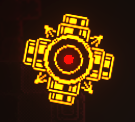

BlobDropTable (DropTable)
- Probability: 1
  - Prefab: FuelPickup (UnityEngine.GameObject)

DropTable Unit CrossRedCaps (DropTable)
- Count: 100
  - Prefab: ResourcePickup_Money (UnityEngine.GameObject)
- Count: 150
  - Prefab: ResourcePickup_Money_50 (UnityEngine.GameObject)
- Count: 5
  - Ingredient: Ingredient Powerstar (Ingredient)
- Count: 10
  - Ingredient: Ingredient Gland (Ingredient)
- Count: 25
  - Prefab: FuelPickup (UnityEngine.GameObject)

TuffDropTable (DropTable)
- Probability: 0.6
  - Prefab: ResourcePickup_White (UnityEngine.GameObject)

DropTable Unit CrossSmallPurple (DropTable)
- Count: 150
  - Prefab: ResourcePickup_Money (UnityEngine.GameObject)
- Count: 60
  - Prefab: ResourcePickup_Money_50 (UnityEngine.GameObject)
- Count: 3
  - Ingredient: Ingredient Powerstar (Ingredient)
- Count: 5
  - Ingredient: Ingredient Coral (Ingredient)
- Count: 25
  - Prefab: FuelPickup (UnityEngine.GameObject)

DropTable Turret Sniper (DropTable)
- Count: 30
  - Prefab: ResourcePickup_Money (UnityEngine.GameObject)
- Count: 10-20
  - Prefab: ResourcePickup_Money_20 (UnityEngine.GameObject)
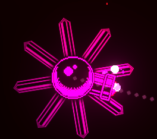

DropTable Unit CrossAlpha (DropTable)
- Count: 4-5
  - Prefab: ResourcePickup_Money (UnityEngine.GameObject)
- Count: 1
  - Prefab: ResourcePickup_Money_20 (UnityEngine.GameObject)
- Probability: 1
  - Prefab: Corpse CrossAlfa (UnityEngine.GameObject)

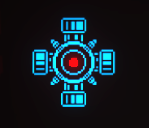

DropTable Crate Caps (DropTable)
- Probability: 1
  - Module: Module Active Caps Igniter (WeaponBasedActiveModuleData)
  - Weight: 30
  - Module: Module Aug Add Burn (ModuleData)
  - Weight: 30
  - Module: Module Aug Caps AddExplosion (ModuleData)
  - Weight: 30
  - Module: Module Active Caps Vial (WeaponBasedActiveModuleData)
  - Weight: 30
  - Module: Module Active Drone Caps (SpawnMinionModuleData)
  - Weight: 20
  - Module: Module Weapon Caps Loon (WeaponModuleData)
  - Weight: 20
  - Module: Module Weapon Caps Laser (WeaponModuleData)
  - Weight: 10
  - Module: Module Weapon Caps Flame (WeaponModuleData)
  - Weight: 10
  - Module: Module Weapon Caps Rocket (WeaponModuleData)
  - Weight: 10
  - Module: Module Passive Shield Caps (ModuleData)
  - Weight: 10
  - Module: Module Passive Add Caps (ModuleData)
  - Weight: 1
- Count: 15
  - Prefab: FuelPickup (UnityEngine.GameObject)
- Count: 15
  - Prefab: ResourcePickup Caps (UnityEngine.GameObject)
- Count: 5
  - Prefab: ResourcePickup_Red (UnityEngine.GameObject)
- Count: 1-2
  - Ingredient: Ingredient Gland (Ingredient)

CellType GoldDropTable (DropTable)
- Count: 5-8
  - Prefab: ResourcePickup_Money (UnityEngine.GameObject)

NightDropTable (DropTable)
- Probability: 0.25
  - Prefab: Enemy_Larva (UnityEngine.GameObject)

DropTable Unit TurretSeeker (DropTable)
- Count: 30
  - Prefab: ResourcePickup_Money (UnityEngine.GameObject)
- Count: 20
  - Prefab: ResourcePickup_Money_20 (UnityEngine.GameObject)
- Count: 10
  - Prefab: ResourcePickup Tech (UnityEngine.GameObject)
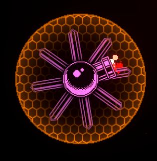

DropTable Crate Tech (DropTable)
- Probability: 1
  - Module: Module Aug Tech AddExplosion (ModuleData)
  - Weight: 10
  - Module: Module Weapon Tech Dandelion (WeaponModuleData)
  - Weight: 10
  - Module: Module Active Drone Phantom (SpawnMinionModuleData)
  - Weight: 10
  - Module: Module Passive Shield Tech (ModuleData)
  - Weight: 10
  - Module: Module Passive Add Tech (ModuleData)
  - Weight: 10
- Count: 15
  - Prefab: FuelPickup (UnityEngine.GameObject)
- Count: 15
  - Prefab: ResourcePickup Tech (UnityEngine.GameObject)
- Count: 5
  - Prefab: ResourcePickup_Red (UnityEngine.GameObject)

DropTable Unit TurretWorm (DropTable)
- Count: 20-25
  - Prefab: ResourcePickup_Money (UnityEngine.GameObject)
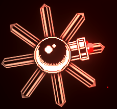

DropTable dt = (DropTable)Paste();
Log(dt);
foreach (var item in dt.items) {
	if (item.countSource == DropTableItemCountSource.Probability) {
		Log($" - Probability: {item.probability}");
	} else {
		if (item.count.Min == item.count.Max) {
		Log($"	- Count: {item.count.Min}");
		} else {
		Log($"	- Count: {item.count.Min}-{item.count.Max}");
		}
	}
	if (item.useGroup) {
		foreach (var groupItem in item.group.itemDistribution.items) {
			if (groupItem.value.droppableType == DroppabbleType.Consumable) {
				Log($"	  - Consumable: {groupItem.value.consumable}");
			} else if (groupItem.value.droppableType == DroppabbleType.Ingedient) {
				Log($"  - Ingredient: {groupItem.value.ingredient}");
			} else if (groupItem.value.droppableType == DroppabbleType.Module) {
				Log($"  - Module: {groupItem.value.module}");
			} else {
				Log($"  - Prefab: {groupItem.value.prefab}");
			}
			Log($"  - Weight: {groupItem.weight}");
		}
	} else {
		if (item.item.droppableType == DroppabbleType.Consumable) {
			Log($"	  - Consumable: {item.item.consumable}");
		} else if (item.item.droppableType == DroppabbleType.Ingedient) {
			Log($"  - Ingredient: {item.item.ingredient}");
		} else if (item.item.droppableType == DroppabbleType.Module) {
			Log($"  - Module: {item.item.module}");
		} else {
			Log($"  - Prefab: {item.item.prefab}");
		}
	}
}
